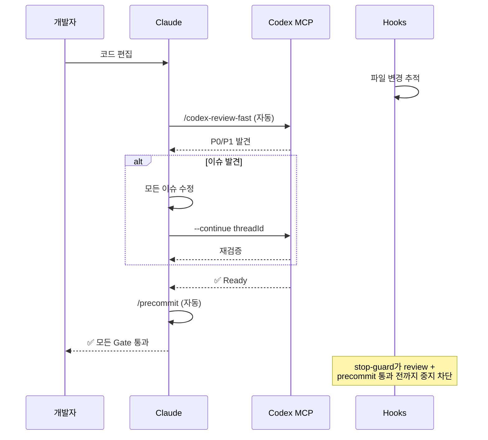
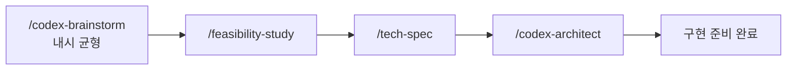
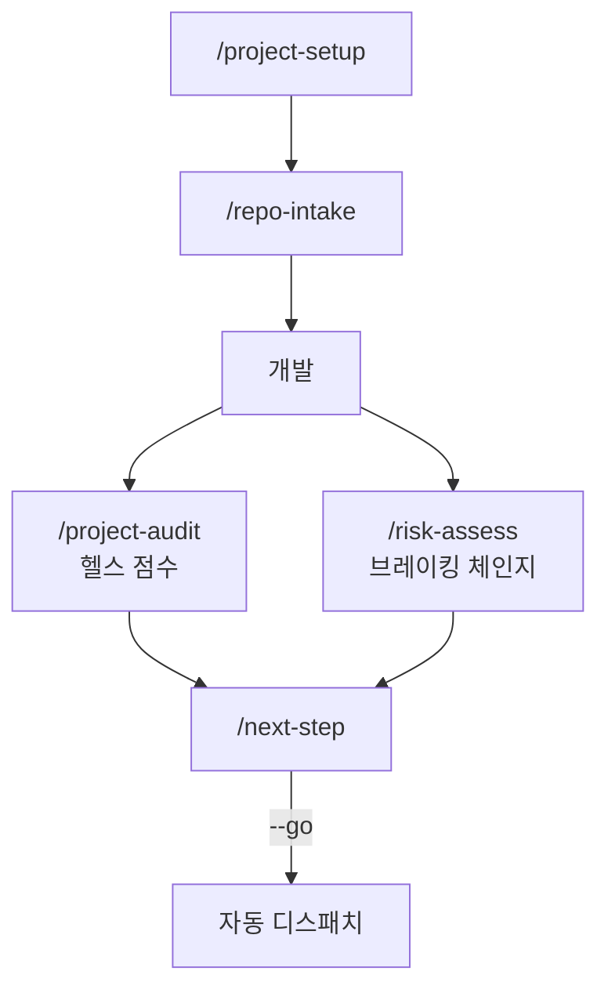
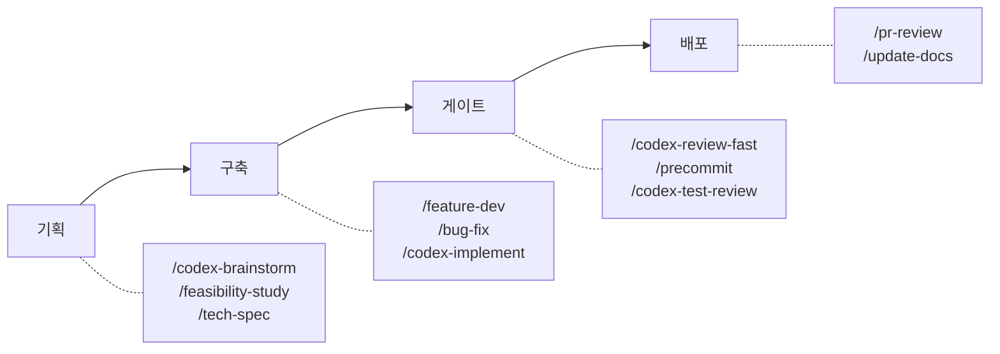

# sd0x-dev-flow

**언어**: [English](README.md) | [繁體中文](README.zh-TW.md) | [简体中文](README.zh-CN.md) | [日本語](README.ja.md) | 한국어 | [Español](README.es.md)

[Claude Code](https://claude.com/claude-code)용 개발 워크플로 플러그인. Codex MCP 연동은 선택 사항입니다.

90개 이상의 도구로 코드 리뷰, 테스트, 이슈 조사, 보안 감사, DevOps 자동화를 지원합니다.

## 최소한의 Context 사용량

본 플러그인은 Claude의 200k Context Window 중 **~4%** 만 사용하면서 90개 이상의 도구를 제공합니다. 이는 핵심적인 아키텍처 장점입니다.

| 구성 요소 | 토큰 수 | 200k 대비 비율 |
|-----------|---------|---------------|
| Rules (상시 로드) | 5.1k | 2.6% |
| Skills (온디맨드) | 1.9k | 1.0% |
| Agents | 791 | 0.4% |
| **합계** | **~8k** | **~4%** |

왜 중요한가:

| 장점 | 설명 |
|------|------|
| 코드를 위한 충분한 공간 | 96%의 Context를 프로젝트 파일, diff, 대화에 사용 가능 |
| 성능 저하 없음 | 플러그인 오버헤드가 극히 작아 응답 속도에 영향 없음 |
| Skills 온디맨드 로드 | 실행한 Skill만 로드되며, 미사용 Skill은 토큰을 소비하지 않음 |
| 복잡한 시나리오 대응 | 한 세션에서 여러 도구를 사용해도 Context 한도에 도달하기 어려움 |

## 요구 사항

- Claude Code 2.1+
- [Codex MCP](https://github.com/openai/codex) 설정 완료 (`/codex-*` 명령어용)

## 설치

```bash
# marketplace 추가
/plugin marketplace add sd0xdev/sd0x-dev-flow

# 플러그인 설치
/plugin install sd0x-dev-flow@sd0xdev-marketplace
```

## 빠른 시작

설치 후 `/project-setup`을 실행하면 프로젝트 환경을 자동 감지하고 placeholder를 설정합니다:

```bash
/project-setup
```

프레임워크, 패키지 매니저, 데이터베이스, 엔트리포인트, 스크립트 명령어를 감지하여 `CLAUDE.md`를 업데이트합니다.

## 포함 내용

| 카테고리 | 수량 | 예시 |
|----------|------|------|
| Commands | 47 | `/project-setup`, `/codex-review-fast`, `/verify`, `/next-step` |
| Skills | 31 | project-setup, code-explore, next-step, skill-health-check |
| Agents | 14 | strict-reviewer, verify-app, coverage-analyst |
| Hooks | 5 | pre-edit-guard, auto-format, review state tracking, stop guard, namespace hint |
| Rules | 10 | auto-loop, codex-invocation, security, testing, git-workflow |
| Scripts | 4 | precommit runner, verify runner, dep audit, namespace hint |

## 워크플로

### Auto-Loop: Edit → Review → Gate

핵심 실행 엔진입니다. 코드 편집 후, Claude가 **자동으로** 같은 응답 내에서 리뷰를 트리거합니다. 수동 작업이 필요 없습니다. 모든 Gate를 통과할 때까지 Hook이 중지를 차단합니다.



### 기획 체인

대립형 브레인스토밍으로 Claude + Codex가 독립적으로 조사하고 다중 라운드 토론을 거쳐 내시 균형에 도달한 후, 구조화된 기획으로 이어집니다.



### 작업 유형별 트랙

```mermaid
flowchart TD
    subgraph feat ["기능 개발"]
        F1["/feature-dev"] --> F2["코드 + 테스트"]
        F2 --> F3["/verify"]
        F3 --> F4["/codex-review-fast"]
        F4 --> F5["/precommit"]
        F5 --> F6["/update-docs"]
    end

    subgraph fix ["버그 수정"]
        B1["/issue-analyze"] --> B2["/bug-fix"]
        B2 --> B3["수정 + 회귀 테스트"]
        B3 --> B4["/verify"]
        B4 --> B5["/codex-review-fast"]
        B5 --> B6["/precommit"]
    end

    subgraph docs ["문서만"]
        D1[".md 편집"] --> D2["/codex-review-doc"]
        D2 --> D3["완료"]
    end
```



### 운영 거버넌스



### 한눈에 보기



### 워크플로 카탈로그

| 워크플로 | 트리거 | 주요 명령어 | Gate | 실행 레이어 |
|----------|--------|------------|------|------------|
| 기능 개발 | 수동 | `/feature-dev` → `/verify` → `/codex-review-fast` → `/precommit` | ✅/⛔ | Hook + 동작 레이어 |
| 버그 수정 | 수동 | `/issue-analyze` → `/bug-fix` → `/verify` → `/codex-review-fast` → `/precommit` | ✅/⛔ | Hook + 동작 레이어 |
| Auto-Loop 리뷰 | 코드 편집 | `/codex-review-fast` → `/precommit` | ✅/⛔ | Hook |
| 문서 리뷰 | `.md` 편집 | `/codex-review-doc` | ✅/⛔ | Hook |
| 문서 동기화 | Precommit 통과 | `/update-docs` → `/create-request --update` | ✅/⚠️ | 동작 레이어 |
| 기획 | 수동 | `/codex-brainstorm` → `/feasibility-study` → `/tech-spec` | — | — |
| 리스크 평가 | 수동 | `/project-audit` → `/risk-assess` | ✅/⛔ | — |
| 온보딩 | 최초 사용 | `/project-setup` → `/repo-intake` → `/install-rules` | — | — |

## 명령어 레퍼런스

### 개발

| 명령어 | 설명 |
|--------|------|
| `/project-setup` | 프로젝트 자동 감지 및 설정 |
| `/repo-intake` | 프로젝트 초기 스캔 (최초 1회) |
| `/install-rules` | 플러그인 규칙을 `.claude/rules/`에 설치 |
| `/install-hooks` | 플러그인 hooks를 `.claude/`에 설치 |
| `/bug-fix` | Bug/Issue 수정 워크플로 |
| `/codex-implement` | Codex가 코드 작성 |
| `/codex-architect` | 아키텍처 자문 (제3의 두뇌) |
| `/code-explore` | 코드베이스 빠른 탐색 |
| `/git-investigate` | 코드 변경 이력 추적 |
| `/issue-analyze` | Issue 심층 분석 |
| `/post-dev-test` | 개발 후 테스트 보완 |
| `/feature-dev` | 기능 개발 워크플로 (설계 → 구현 → 검증 → 리뷰) |
| `/feature-verify` | 시스템 진단 (읽기 전용 검증, 이중 관점 확인) |
| `/code-investigate` | 이중 관점 코드 조사 (Claude + Codex 독립 탐색) |
| `/next-step` | 컨텍스트 인식 다음 단계 어드바이저 |

### 리뷰 (Codex MCP)

| 명령어 | 설명 | Loop 지원 |
|--------|------|-----------|
| `/codex-review-fast` | 빠른 리뷰 (diff만) | `--continue <threadId>` |
| `/codex-review` | 전체 리뷰 (lint + build) | `--continue <threadId>` |
| `/codex-review-branch` | 브랜치 전체 리뷰 | - |
| `/codex-cli-review` | CLI 리뷰 (전체 디스크 읽기) | - |
| `/codex-review-doc` | 문서 리뷰 | `--continue <threadId>` |
| `/codex-security` | OWASP Top 10 감사 | `--continue <threadId>` |
| `/codex-test-gen` | 유닛 테스트 생성 | - |
| `/codex-test-review` | 테스트 커버리지 리뷰 | `--continue <threadId>` |
| `/codex-explain` | 복잡한 코드 설명 | - |

### 검증

| 명령어 | 설명 |
|--------|------|
| `/verify` | lint -> typecheck -> unit -> integration -> e2e |
| `/precommit` | lint:fix -> build -> test:unit |
| `/precommit-fast` | lint:fix -> test:unit |
| `/dep-audit` | 디펜던시 보안 감사 |
| `/project-audit` | 프로젝트 헬스 감사 (결정론적 스코어링) |
| `/risk-assess` | 미커밋 코드 리스크 평가 |

### 기획

| 명령어 | 설명 |
|--------|------|
| `/codex-brainstorm` | 대립형 브레인스토밍 (내시 균형) |
| `/feasibility-study` | 타당성 분석 |
| `/tech-spec` | 기술 스펙 작성 |
| `/review-spec` | 기술 스펙 리뷰 |
| `/deep-analyze` | 심층 분석 + 로드맵 |
| `/project-brief` | PM/CTO용 요약 보고서 |

### 문서 & 도구

| 명령어 | 설명 |
|--------|------|
| `/update-docs` | 문서-코드 동기화 |
| `/check-coverage` | 테스트 커버리지 분석 |
| `/create-request` | 요구사항 문서 생성/업데이트 |
| `/doc-refactor` | 문서 간소화 |
| `/simplify` | 코드 간소화 |
| `/de-ai-flavor` | AI 생성 흔적 제거 |
| `/create-skill` | 새 스킬 생성 |
| `/pr-review` | PR 셀프 리뷰 |
| `/skill-health-check` | 스킬 품질 및 라우팅 검증 |
| `/claude-health` | Claude Code 설정 상태 점검 |
| `/zh-tw` | 번체 중국어로 변환 |

## Rules

| Rule | 설명 |
|------|------|
| `auto-loop` | 수정 -> 재리뷰 -> 수정 -> ... -> Pass (자동 순환) |
| `codex-invocation` | Codex는 독립적으로 조사해야 하며, 결론 주입 금지 |
| `fix-all-issues` | 제로 톨러런스: 발견된 이슈 전부 수정 |
| `framework` | 프레임워크별 컨벤션 (커스터마이즈 가능) |
| `testing` | Unit/Integration/E2E 격리 |
| `security` | OWASP Top 10 체크리스트 |
| `git-workflow` | 브랜치 네이밍, 커밋 컨벤션 |
| `docs-writing` | 테이블 > 문단, Mermaid > 텍스트 |
| `docs-numbering` | 문서 접두사 컨벤션 (0-feasibility, 2-spec) |
| `logging` | 구조화된 JSON, 시크릿 금지 |

## Hooks

| Hook | 트리거 | 용도 |
|------|--------|------|
| `namespace-hint` | SessionStart | Claude context에 플러그인 명령어 네임스페이스 안내를 주입 |
| `post-edit-format` | Edit/Write 후 | 자동 prettier + 편집 시 리뷰 상태 리셋 |
| `post-tool-review-state` | Bash / MCP 도구 후 | 리뷰 상태 트래킹 (sentinel 라우팅, 네임스페이스 명령어 지원) |
| `pre-edit-guard` | Edit/Write 전 | .env/.git 편집 방지 |
| `stop-guard` | 중지 전 | 리뷰 미완료 시 경고 + stale-state git 체크 (기본값: warn) |

### Hook 설정

Hook은 기본적으로 안전합니다. 환경 변수로 동작을 커스터마이즈할 수 있습니다:

| 변수 | 기본값 | 설명 |
|------|--------|------|
| `STOP_GUARD_MODE` | `warn` | `strict`로 설정 시 리뷰 단계 누락 시 중지 차단 |
| `HOOK_NO_FORMAT` | (미설정) | `1`로 설정 시 자동 포맷팅 비활성화 |
| `HOOK_BYPASS` | (미설정) | `1`로 설정 시 stop-guard 체크 전부 스킵 |
| `HOOK_DEBUG` | (미설정) | `1`로 설정 시 디버그 정보 출력 |
| `GUARD_EXTRA_PATTERNS` | (미설정) | 추가 보호 경로 정규식 (예: `src/locales/.*\.json$`) |

**디펜던시**: Hook에는 `jq`가 필요합니다. 자동 포맷팅에는 `prettier`가 필요합니다. 없으면 자동으로 스킵됩니다.

## 커스터마이즈

`/project-setup`으로 모든 placeholder를 자동 감지/설정하거나, `CLAUDE.md`를 직접 편집:

| Placeholder | 설명 | 예시 |
|-------------|------|------|
| `{PROJECT_NAME}` | 프로젝트 이름 | my-app |
| `{FRAMEWORK}` | 프레임워크 | MidwayJS 3.x, NestJS, Express |
| `{CONFIG_FILE}` | 메인 설정 파일 | src/configuration.ts |
| `{BOOTSTRAP_FILE}` | 부트스트랩 엔트리 | bootstrap.js, main.ts |
| `{DATABASE}` | 데이터베이스 | MongoDB, PostgreSQL |
| `{TEST_COMMAND}` | 테스트 명령어 | yarn test:unit |
| `{LINT_FIX_COMMAND}` | Lint 자동 수정 | yarn lint:fix |
| `{BUILD_COMMAND}` | 빌드 명령어 | yarn build |
| `{TYPECHECK_COMMAND}` | 타입 체크 | yarn typecheck |

## 아키텍처

```
Command (진입점) -> Skill (기능) -> Agent (실행 환경)
```

- **Commands**: 사용자가 `/...`로 실행
- **Skills**: 요청 시 로드되는 지식 베이스
- **Agents**: 전용 도구를 가진 격리된 서브에이전트
- **Hooks**: 자동화 가드레일 (포맷팅, 리뷰 상태, 스톱 가드)
- **Rules**: 항상 활성화된 컨벤션 (자동 로드)
- **Scripts**: 검증 명령어용 선택적 가속 스크립트 (아래 참조)

### 스크립트 폴백

검증 명령어(`/precommit`, `/verify`, `/dep-audit`)는 **Try → Fallback** 패턴을 사용합니다:

1. **Try**: 프로젝트 루트에 러너 스크립트(`scripts/precommit-runner.js` 등)가 있으면 이를 실행하여 빠르고 재현 가능한 결과를 얻습니다.
2. **Fallback**: 스크립트가 없으면 Claude가 프로젝트 에코시스템(Node.js, Python, Rust, Go, Java)을 자동 감지하고 적절한 명령어를 직접 실행합니다.

Fallback은 별도 설정 없이 바로 사용 가능합니다. 러너 스크립트는 본 플러그인에 포함되어 있지만, [Claude Code의 알려진 제한](https://github.com/anthropics/claude-code/issues/9354)(`${CLAUDE_PLUGIN_ROOT}`가 커맨드 마크다운에서 사용 불가)으로 인해 현재 플러그인 명령어에서 스크립트 경로를 자동 해석할 수 없습니다. 업스트림 이슈가 해결되면 업데이트 예정입니다.

## 기여

PR 환영합니다. 다음 사항을 지켜주세요:

1. 기존 네이밍 컨벤션 준수 (kebab-case)
2. 스킬에 `When to Use` / `When NOT to Use` 포함
3. 위험한 작업에는 `disable-model-invocation: true` 추가
4. 제출 전 Claude Code로 테스트

## 라이선스

MIT
