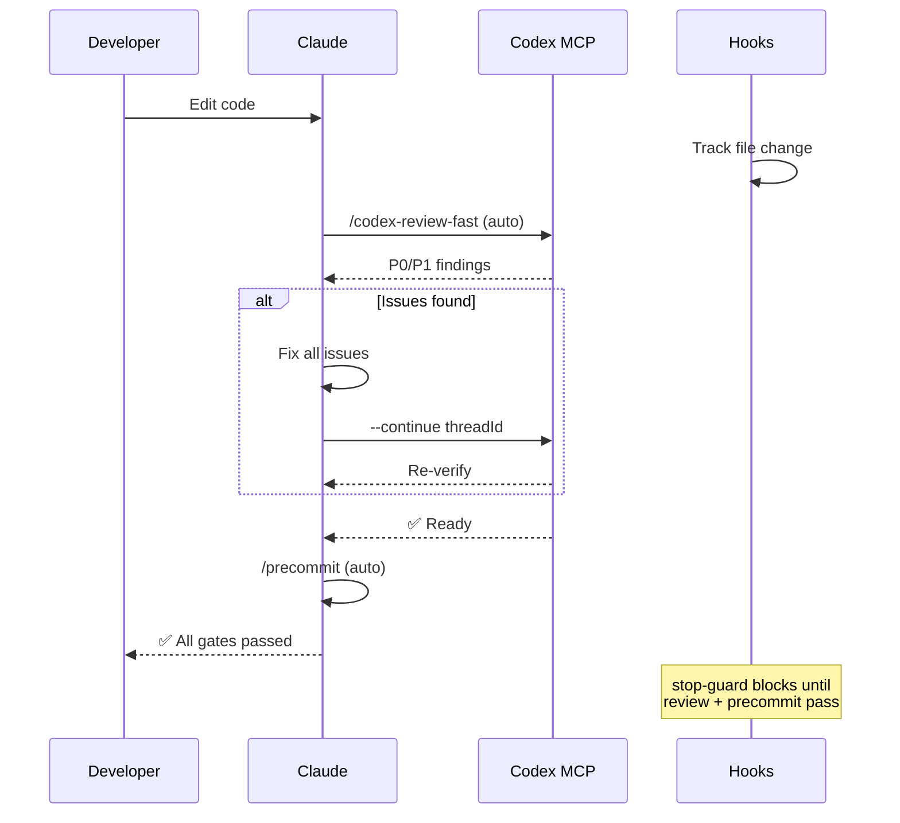
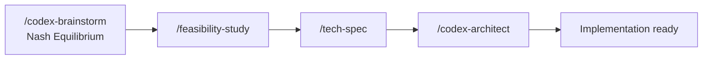
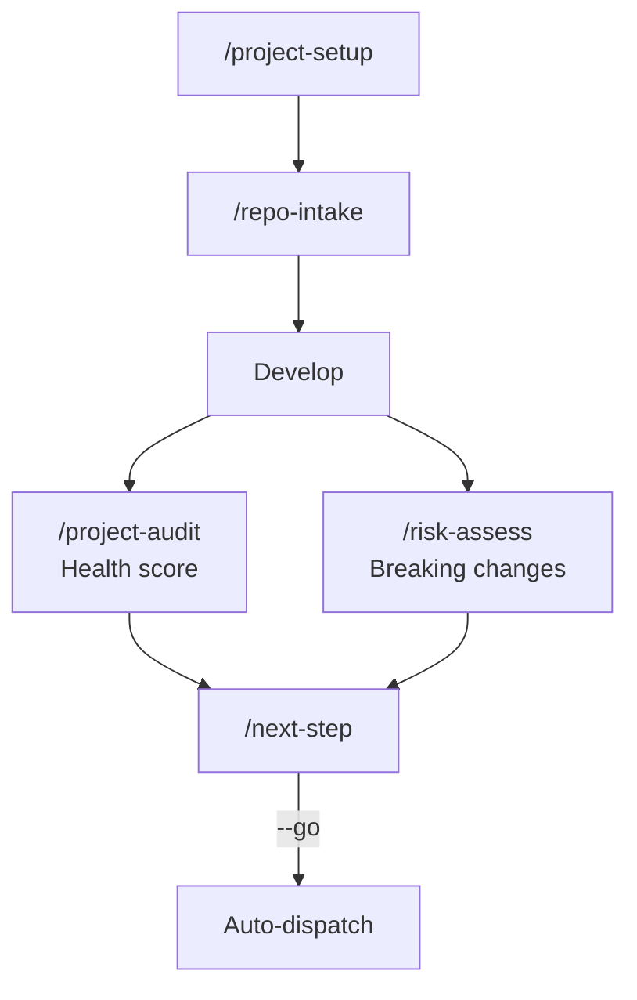
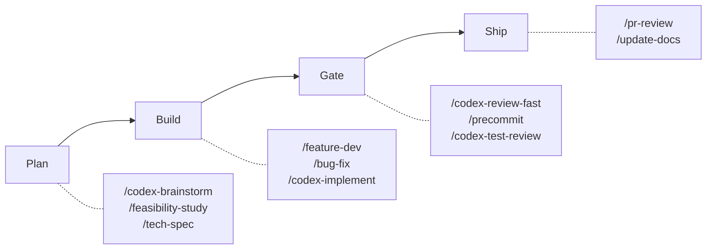

# jupiter-dev-flow

**Language**: English | [繁體中文](README.zh-TW.md) | [简体中文](README.zh-CN.md) | [日本語](README.ja.md) | [한국어](README.ko.md) | [Español](README.es.md)

Development workflow plugin for [Claude Code](https://claude.com/claude-code) with optional Codex MCP integration.

90+ tools covering code review, testing, investigation, security audit, and DevOps automation.

## Minimal Context Footprint

This plugin occupies only **~4% of Claude's 200k context window** while delivering 90+ tools — a key architectural advantage.

| Component | Tokens | % of 200k |
|-----------|--------|-----------|
| Rules (always loaded) | 5.1k | 2.6% |
| Skills (on-demand) | 1.9k | 1.0% |
| Agents | 791 | 0.4% |
| **Total** | **~8k** | **~4%** |

Why this matters:

| Advantage | Description |
|-----------|-------------|
| More room for your code | 96% of context remains for your project files, diffs, and conversation |
| No performance degradation | Plugin overhead is negligible — Claude responds just as fast |
| Skills load on-demand | Only the skill you invoke gets loaded; idle skills cost zero tokens |
| Scales with complexity | You can use multiple tools in one session without hitting context limits |

## Requirements

- Claude Code 2.1+
- [Codex MCP](https://github.com/openai/codex) configured (for `/codex-*` commands)

## Install

```bash
# Add marketplace
/plugin marketplace add jupiter-Pulin/plugin-repo

# Install plugin
/plugin install jupiter-dev-flow@jupiter-marketplace
```

## Quick Start

After installing, run `/project-setup` to auto-detect your project environment and configure all placeholders:

```bash
/project-setup
```

This will detect your framework, package manager, database, entrypoints, and script commands, then update `CLAUDE.md` accordingly.

## What's Included

| Category | Count | Examples |
|----------|-------|---------|
| Commands | 47 | `/project-setup`, `/codex-review-fast`, `/verify`, `/next-step` |
| Skills | 31 | project-setup, code-explore, next-step, skill-health-check |
| Agents | 14 | strict-reviewer, verify-app, coverage-analyst |
| Hooks | 5 | pre-edit-guard, auto-format, review state tracking, stop guard, namespace hint |
| Rules | 10 | auto-loop, codex-invocation, security, testing, git-workflow |
| Scripts | 4 | precommit runner, verify runner, dep audit, namespace hint |

## Workflow

### Auto-Loop: Edit → Review → Gate

The core enforcement engine. After any code edit, Claude **automatically** triggers review in the same reply — no manual steps. Hooks block stopping until all gates pass.



### Planning Chain

Adversarial brainstorming reaches Nash Equilibrium through independent Claude + Codex research and multi-round debate, then flows into structured planning.



### Work-Type Tracks

```mermaid
flowchart TD
    subgraph feat ["Feature Development"]
        F1["/feature-dev"] --> F2["Code + Tests"]
        F2 --> F3["/verify"]
        F3 --> F4["/codex-review-fast"]
        F4 --> F5["/precommit"]
        F5 --> F6["/update-docs"]
    end

    subgraph fix ["Bug Fix"]
        B1["/issue-analyze"] --> B2["/bug-fix"]
        B2 --> B3["Fix + Regression test"]
        B3 --> B4["/verify"]
        B4 --> B5["/codex-review-fast"]
        B5 --> B6["/precommit"]
    end

    subgraph docs ["Docs Only"]
        D1["Edit .md"] --> D2["/codex-review-doc"]
        D2 --> D3["Done"]
    end
```



### Operational Governance



### At a Glance



### Workflow Catalog

| Workflow | Trigger | Primary Commands | Gate | Enforced By |
|----------|---------|------------------|------|-------------|
| Feature Development | Manual | `/feature-dev` → `/verify` → `/codex-review-fast` → `/precommit` | ✅/⛔ | Hook + Behavior |
| Bug Fix | Manual | `/issue-analyze` → `/bug-fix` → `/verify` → `/codex-review-fast` → `/precommit` | ✅/⛔ | Hook + Behavior |
| Auto-Loop Review | Code edit | `/codex-review-fast` → `/precommit` | ✅/⛔ | Hook |
| Doc Review | `.md` edit | `/codex-review-doc` | ✅/⛔ | Hook |
| Doc Sync | Precommit pass | `/update-docs` → `/create-request --update` | ✅/⚠️ | Behavior |
| Planning | Manual | `/codex-brainstorm` → `/feasibility-study` → `/tech-spec` | — | — |
| Risk Assessment | Manual | `/project-audit` → `/risk-assess` | ✅/⛔ | — |
| Onboarding | First use | `/project-setup` → `/repo-intake` → `/install-rules` | — | — |

## Commands Reference

### Development

| Command | Description |
|---------|-------------|
| `/project-setup` | Auto-detect and configure project |
| `/repo-intake` | One-time project intake scan |
| `/install-rules` | Install plugin rules to `.claude/rules/` |
| `/install-hooks` | Install plugin hooks to `.claude/` |
| `/bug-fix` | Bug/Issue fix workflow |
| `/codex-implement` | Codex writes code |
| `/codex-architect` | Architecture advice (third brain) |
| `/code-explore` | Fast codebase exploration |
| `/git-investigate` | Track code history |
| `/issue-analyze` | Deep issue analysis |
| `/post-dev-test` | Post-dev test completion |
| `/feature-dev` | Feature development workflow (design → implement → verify → review) |
| `/feature-verify` | System diagnosis (read-only verification with dual-perspective) |
| `/code-investigate` | Dual-perspective code investigation (Claude + Codex independent) |
| `/next-step` | Context-aware next step advisor |

### Review (Codex MCP)

| Command | Description | Loop Support |
|---------|-------------|--------------|
| `/codex-review-fast` | Quick review (diff only) | `--continue <threadId>` |
| `/codex-review` | Full review (lint + build) | `--continue <threadId>` |
| `/codex-review-branch` | Full branch review | - |
| `/codex-cli-review` | CLI review (full disk read) | - |
| `/codex-review-doc` | Document review | `--continue <threadId>` |
| `/codex-security` | OWASP Top 10 audit | `--continue <threadId>` |
| `/codex-test-gen` | Generate unit tests | - |
| `/codex-test-review` | Review test coverage | `--continue <threadId>` |
| `/codex-explain` | Explain complex code | - |

### Verification

| Command | Description |
|---------|-------------|
| `/verify` | lint -> typecheck -> unit -> integration -> e2e |
| `/precommit` | lint:fix -> build -> test:unit |
| `/precommit-fast` | lint:fix -> test:unit |
| `/dep-audit` | Dependency security audit |
| `/project-audit` | Project health audit (deterministic scoring) |
| `/risk-assess` | Uncommitted code risk assessment |

### Planning

| Command | Description |
|---------|-------------|
| `/codex-brainstorm` | Adversarial brainstorm (Nash equilibrium) |
| `/feasibility-study` | Feasibility analysis |
| `/tech-spec` | Generate tech spec |
| `/review-spec` | Review tech spec |
| `/deep-analyze` | Deep analysis + roadmap |
| `/project-brief` | PM/CTO executive summary |

### Documentation & Tooling

| Command | Description |
|---------|-------------|
| `/update-docs` | Sync docs with code |
| `/check-coverage` | Test coverage analysis |
| `/create-request` | Create/update request docs |
| `/doc-refactor` | Simplify documents |
| `/simplify` | Code simplification |
| `/de-ai-flavor` | Remove AI-generated artifacts from documents |
| `/create-skill` | Create new skills |
| `/pr-review` | PR self-review |
| `/skill-health-check` | Validate skill quality and routing |
| `/claude-health` | Claude Code config health check |
| `/zh-tw` | Rewrite in Traditional Chinese |

## Rules

| Rule | Description |
|------|-------------|
| `auto-loop` | Fix -> re-review -> fix -> ... -> Pass (auto cycle) |
| `codex-invocation` | Codex must independently research, never feed conclusions |
| `fix-all-issues` | Zero tolerance: fix every issue found |
| `framework` | Framework-specific conventions (customizable) |
| `testing` | Unit/Integration/E2E isolation |
| `security` | OWASP Top 10 checklist |
| `git-workflow` | Branch naming, commit conventions |
| `docs-writing` | Tables > paragraphs, Mermaid > text |
| `docs-numbering` | Document prefix convention (0-feasibility, 2-spec) |
| `logging` | Structured JSON, no secrets |

## Hooks

| Hook | Trigger | Purpose |
|------|---------|---------|
| `namespace-hint` | SessionStart | Inject plugin command namespace guidance into Claude context |
| `post-edit-format` | After Edit/Write | Auto prettier + invalidate review state on edit |
| `post-tool-review-state` | After Bash / MCP tools | Track review state (sentinel routing, supports namespaced commands) |
| `pre-edit-guard` | Before Edit/Write | Prevent editing .env/.git |
| `stop-guard` | Before stop | Warn on incomplete reviews + stale-state git check (default: warn) |

### Hook Configuration

Hooks are safe by default. Use environment variables to customize behavior:

| Variable | Default | Description |
|----------|---------|-------------|
| `STOP_GUARD_MODE` | `warn` | Set `strict` to block stop on missing review steps |
| `HOOK_NO_FORMAT` | (unset) | Set `1` to disable auto-formatting |
| `HOOK_BYPASS` | (unset) | Set `1` to skip all stop-guard checks |
| `HOOK_DEBUG` | (unset) | Set `1` to output debug info |
| `GUARD_EXTRA_PATTERNS` | (unset) | Regex patterns for extra protected paths (e.g. `src/locales/.*\.json$`) |

**Dependencies**: Hooks require `jq`. Auto-format requires `prettier` installed in the project. Missing dependencies are handled gracefully (hooks skip silently).

## Customization

Run `/project-setup` to auto-detect and configure all placeholders, or manually edit `CLAUDE.md`:

| Placeholder | Description | Example |
|-------------|-------------|---------|
| `{PROJECT_NAME}` | Your project name | my-app |
| `{FRAMEWORK}` | Your framework | MidwayJS 3.x, NestJS, Express |
| `{CONFIG_FILE}` | Main config file | src/configuration.ts |
| `{BOOTSTRAP_FILE}` | Bootstrap entry | bootstrap.js, main.ts |
| `{DATABASE}` | Database | MongoDB, PostgreSQL |
| `{TEST_COMMAND}` | Test command | yarn test:unit |
| `{LINT_FIX_COMMAND}` | Lint auto-fix | yarn lint:fix |
| `{BUILD_COMMAND}` | Build command | yarn build |
| `{TYPECHECK_COMMAND}` | Type checking | yarn typecheck |

## Architecture

```
Command (entry) -> Skill (capability) -> Agent (environment)
```

- **Commands**: User-triggered via `/...`
- **Skills**: Knowledge bases loaded on demand
- **Agents**: Isolated subagents with specific tools
- **Hooks**: Automated guardrails (format, review state, stop guard)
- **Rules**: Always-on conventions (auto-loaded)
- **Scripts**: Optional accelerators for verification commands (see below)

### Script Fallback

Verification commands (`/precommit`, `/verify`, `/dep-audit`) use a **Try → Fallback** pattern:

1. **Try**: If a runner script exists in the project root (`scripts/precommit-runner.js`, etc.), use it for fast, deterministic execution.
2. **Fallback**: If no script is found, Claude detects the project ecosystem (Node.js, Python, Rust, Go, Java) and runs the appropriate commands directly.

The fallback works out of the box with no setup required. Runner scripts are bundled in this plugin repo but cannot be auto-resolved from plugin commands due to a [Claude Code limitation](https://github.com/anthropics/claude-code/issues/9354) (`${CLAUDE_PLUGIN_ROOT}` is unavailable in command markdown). This will be updated when the upstream issue is resolved.

## Contributing

PRs welcome. Please:

1. Follow existing naming conventions (kebab-case)
2. Include `When to Use` / `When NOT to Use` in skills
3. Add `disable-model-invocation: true` for dangerous operations
4. Test with Claude Code before submitting

## License

MIT

## Star History

[](https://www.star-history.com/#jupiter-Pulin/plugin-repo&type=date&legend=top-left)
