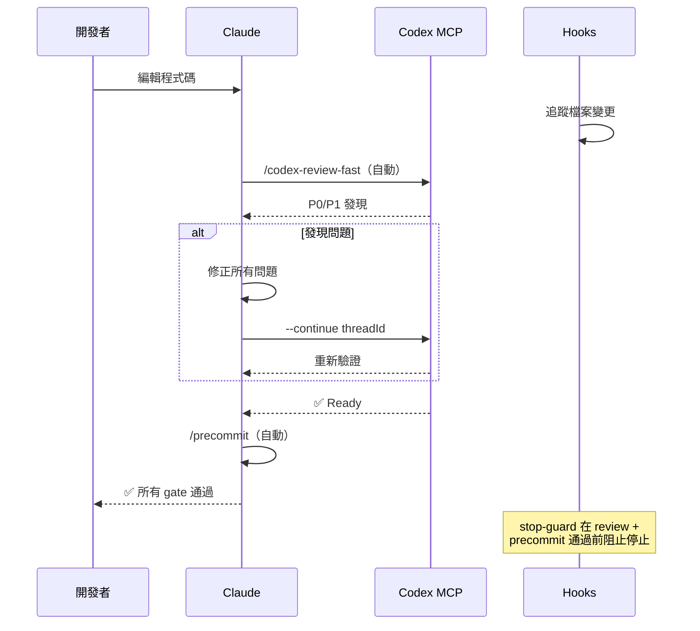
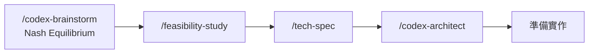
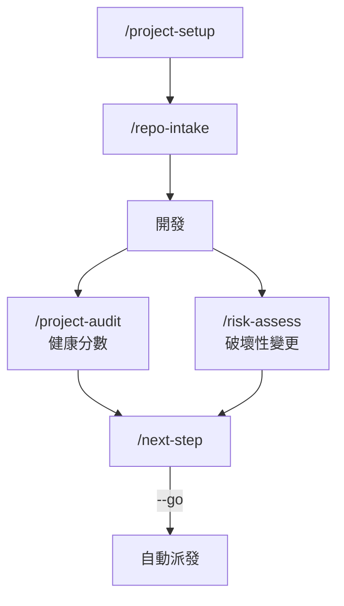
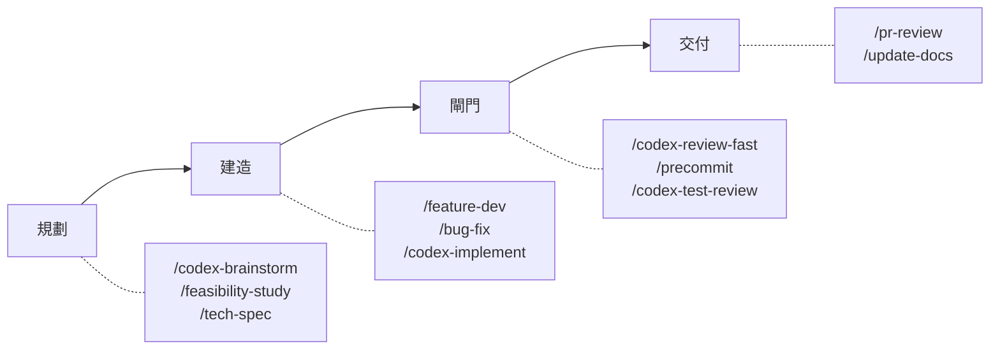

# jupiter-dev-flow

**語言**: [English](README.md) | 繁體中文 | [简体中文](README.zh-CN.md) | [日本語](README.ja.md) | [한국어](README.ko.md) | [Español](README.es.md)

[Claude Code](https://claude.com/claude-code) 的開發 Workflow Plugin，可選整合 Codex MCP。

90+ 個工具，涵蓋 Code Review、測試、調查、安全稽核與 DevOps 自動化。

## 極小的 Context 佔用

本 Plugin 僅佔用 Claude 200k Context Window 的 **~4%**，同時提供 90+ 個工具——這是核心架構優勢。

| 組件 | Tokens | 佔 200k 比例 |
|------|--------|-------------|
| Rules（常駐載入） | 5.1k | 2.6% |
| Skills（按需載入） | 1.9k | 1.0% |
| Agents | 791 | 0.4% |
| **合計** | **~8k** | **~4%** |

為什麼這很重要：

| 優勢 | 說明 |
|------|------|
| 保留更多空間給程式碼 | 96% 的 Context 留給你的專案檔案、diff 與對話 |
| 不影響效能 | Plugin 開銷極低，Claude 回應速度不受影響 |
| Skills 按需載入 | 只有執行的 Skill 才會載入，閒置 Skill 不佔用任何 Token |
| 應對複雜場景 | 單次對話可使用多個工具，不易觸及 Context 上限 |

## 需求

- Claude Code 2.1+
- [Codex MCP](https://github.com/openai/codex) 已設定（用於 `/codex-*` 指令）

## 安裝

```bash
# 新增 marketplace
/plugin marketplace add jupiter-Pulin/plugin-repo

# 安裝 plugin
/plugin install jupiter-dev-flow@jupiter-marketplace
```

## 快速開始

安裝完成後，執行 `/project-setup` 自動偵測專案環境並設定所有 placeholder：

```bash
/project-setup
```

這會偵測你的 framework、package manager、資料庫、entry point 和 script 指令，然後相應更新 `CLAUDE.md`。

## 包含內容

| 類別 | 數量 | 範例 |
|------|------|------|
| Commands | 47 | `/project-setup`, `/codex-review-fast`, `/verify`, `/next-step` |
| Skills | 31 | project-setup, code-explore, next-step, skill-health-check |
| Agents | 14 | strict-reviewer, verify-app, coverage-analyst |
| Hooks | 5 | pre-edit-guard, auto-format, review state tracking, stop guard, namespace hint |
| Rules | 10 | auto-loop, codex-invocation, security, testing, git-workflow |
| Scripts | 4 | precommit runner, verify runner, dep audit, namespace hint |

## Workflow

### Auto-Loop：Edit → Review → Gate

核心執行引擎。任何 code 編輯後，Claude **自動**在同一回覆中觸發 review——不需手動操作。Hooks 在所有 gate 通過前阻止停止。



### 規劃鏈

對抗式 brainstorming 透過 Claude + Codex 獨立研究與多輪辯論達成 Nash Equilibrium，接著進入結構化規劃。



### 工作類型路徑

```mermaid
flowchart TD
    subgraph feat ["功能開發"]
        F1["/feature-dev"] --> F2["寫 Code + 測試"]
        F2 --> F3["/verify"]
        F3 --> F4["/codex-review-fast"]
        F4 --> F5["/precommit"]
        F5 --> F6["/update-docs"]
    end

    subgraph fix ["Bug 修正"]
        B1["/issue-analyze"] --> B2["/bug-fix"]
        B2 --> B3["修正 + 迴歸測試"]
        B3 --> B4["/verify"]
        B4 --> B5["/codex-review-fast"]
        B5 --> B6["/precommit"]
    end

    subgraph docs ["純文件"]
        D1["編輯 .md"] --> D2["/codex-review-doc"]
        D2 --> D3["完成"]
    end
```



### 營運治理



### 一覽



### Workflow 目錄

| Workflow | 觸發方式 | 主要指令 | Gate | 執行層 |
|----------|----------|----------|------|--------|
| 功能開發 | 手動 | `/feature-dev` → `/verify` → `/codex-review-fast` → `/precommit` | ✅/⛔ | Hook + 行為層 |
| Bug 修正 | 手動 | `/issue-analyze` → `/bug-fix` → `/verify` → `/codex-review-fast` → `/precommit` | ✅/⛔ | Hook + 行為層 |
| Auto-Loop Review | Code 編輯 | `/codex-review-fast` → `/precommit` | ✅/⛔ | Hook |
| 文件 Review | `.md` 編輯 | `/codex-review-doc` | ✅/⛔ | Hook |
| 文件同步 | Precommit 通過 | `/update-docs` → `/create-request --update` | ✅/⚠️ | 行為層 |
| 規劃 | 手動 | `/codex-brainstorm` → `/feasibility-study` → `/tech-spec` | — | — |
| 風險評估 | 手動 | `/project-audit` → `/risk-assess` | ✅/⛔ | — |
| 上手流程 | 首次使用 | `/project-setup` → `/repo-intake` → `/install-rules` | — | — |

## 指令參考

### 開發

| 指令 | 說明 |
|------|------|
| `/project-setup` | 自動偵測並設定專案 |
| `/repo-intake` | 一次性專案盤點掃描 |
| `/install-rules` | 安裝 plugin 規則到 `.claude/rules/` |
| `/install-hooks` | 安裝 plugin hooks 到 `.claude/` |
| `/bug-fix` | Bug/Issue 修正 workflow |
| `/codex-implement` | Codex 寫 code |
| `/codex-architect` | 架構建議（第三大腦） |
| `/code-explore` | 快速 codebase 探索 |
| `/git-investigate` | 追蹤 code 歷史 |
| `/issue-analyze` | 深度 Issue 分析 |
| `/post-dev-test` | 開發後測試補全 |
| `/feature-dev` | 功能開發流程（設計 → 實作 → 驗證 → Review） |
| `/feature-verify` | 系統診斷（唯讀驗證，雙視角確認） |
| `/code-investigate` | 雙視角程式碼調查（Claude + Codex 獨立探索） |
| `/next-step` | 情境感知的下一步建議 |

### Review（Codex MCP）

| 指令 | 說明 | Loop 支援 |
|------|------|-----------|
| `/codex-review-fast` | 快速 review（僅 diff） | `--continue <threadId>` |
| `/codex-review` | 完整 review（lint + build） | `--continue <threadId>` |
| `/codex-review-branch` | 完整 branch review | - |
| `/codex-cli-review` | CLI review（完整磁碟讀取） | - |
| `/codex-review-doc` | 文件 review | `--continue <threadId>` |
| `/codex-security` | OWASP Top 10 audit | `--continue <threadId>` |
| `/codex-test-gen` | 產生 unit test | - |
| `/codex-test-review` | Review test coverage | `--continue <threadId>` |
| `/codex-explain` | 解釋複雜 code | - |

### 驗證

| 指令 | 說明 |
|------|------|
| `/verify` | lint -> typecheck -> unit -> integration -> e2e |
| `/precommit` | lint:fix -> build -> test:unit |
| `/precommit-fast` | lint:fix -> test:unit |
| `/dep-audit` | 依賴套件安全稽核 |
| `/project-audit` | 專案健康審計（確定性評分） |
| `/risk-assess` | 未提交程式碼風險評估 |

### 規劃

| 指令 | 說明 |
|------|------|
| `/codex-brainstorm` | 對抗式 brainstorming（Nash 均衡） |
| `/feasibility-study` | 可行性分析 |
| `/tech-spec` | 產生 tech spec |
| `/review-spec` | Review tech spec |
| `/deep-analyze` | 深度分析 + roadmap |
| `/project-brief` | PM/CTO 執行摘要 |

### 文件與工具

| 指令 | 說明 |
|------|------|
| `/update-docs` | 同步文件與 code |
| `/check-coverage` | Test coverage 分析 |
| `/create-request` | 建立/更新需求文件 |
| `/doc-refactor` | 簡化文件 |
| `/simplify` | Code 簡化 |
| `/de-ai-flavor` | 移除 AI 痕跡 |
| `/create-skill` | 建立新 skill |
| `/pr-review` | PR self-review |
| `/skill-health-check` | 驗證 Skill 品質與 routing |
| `/claude-health` | Claude Code 設定健康檢查 |
| `/zh-tw` | 以繁體中文改寫 |

## Rules

| Rule | 說明 |
|------|------|
| `auto-loop` | 修正 -> 重新 review -> 修正 -> ... -> Pass（自動循環） |
| `codex-invocation` | Codex 必須自主調研，禁止餵結論 |
| `fix-all-issues` | 零容忍：修正所有發現的問題 |
| `framework` | Framework 專屬慣例（可自訂） |
| `testing` | Unit/Integration/E2E 隔離 |
| `security` | OWASP Top 10 checklist |
| `git-workflow` | Branch 命名、commit 慣例 |
| `docs-writing` | 表格 > 段落，Mermaid > 文字 |
| `docs-numbering` | 文件前綴慣例（0-feasibility, 2-spec） |
| `logging` | 結構化 JSON，禁止 secrets |

## Hooks

| Hook | 觸發時機 | 用途 |
|------|----------|------|
| `namespace-hint` | SessionStart | 在 Claude context 中注入外掛指令命名空間指引 |
| `post-edit-format` | Edit/Write 之後 | 自動 prettier + 編輯後重設 review 狀態 |
| `post-tool-review-state` | Bash / MCP 工具之後 | 追蹤 review 狀態（sentinel routing，支援命名空間指令） |
| `pre-edit-guard` | Edit/Write 之前 | 防止編輯 .env/.git |
| `stop-guard` | 停止之前 | 未完成 review 時警告 + stale-state git 檢查（預設：warn） |

### Hook 設定

Hook 預設是安全的。使用環境變數自訂行為：

| 變數 | 預設值 | 說明 |
|------|--------|------|
| `STOP_GUARD_MODE` | `warn` | 設為 `strict` 可在缺少 review 步驟時阻止停止 |
| `HOOK_NO_FORMAT` | （未設定） | 設為 `1` 停用自動 format |
| `HOOK_BYPASS` | （未設定） | 設為 `1` 跳過所有 stop-guard 檢查 |
| `HOOK_DEBUG` | （未設定） | 設為 `1` 輸出 debug 資訊 |
| `GUARD_EXTRA_PATTERNS` | （未設定） | 額外保護路徑的 regex（例如 `src/locales/.*\.json$`） |

**Dependencies**：Hook 需要 `jq`。自動 format 需要專案已安裝 `prettier`。缺少 dependency 時會自動略過。

## 自訂設定

執行 `/project-setup` 自動偵測並設定所有 placeholder，或手動編輯 `CLAUDE.md`：

| Placeholder | 說明 | 範例 |
|-------------|------|------|
| `{PROJECT_NAME}` | 你的專案名稱 | my-app |
| `{FRAMEWORK}` | 你的 framework | MidwayJS 3.x, NestJS, Express |
| `{CONFIG_FILE}` | 主設定檔 | src/configuration.ts |
| `{BOOTSTRAP_FILE}` | Bootstrap entry | bootstrap.js, main.ts |
| `{DATABASE}` | 資料庫 | MongoDB, PostgreSQL |
| `{TEST_COMMAND}` | 測試指令 | yarn test:unit |
| `{LINT_FIX_COMMAND}` | Lint 自動修正 | yarn lint:fix |
| `{BUILD_COMMAND}` | Build 指令 | yarn build |
| `{TYPECHECK_COMMAND}` | Type check | yarn typecheck |

## 架構

```
Command（入口）-> Skill（能力）-> Agent（環境）
```

- **Commands**：使用者透過 `/...` 觸發
- **Skills**：按需載入的知識庫
- **Agents**：擁有特定工具的隔離 sub-agent
- **Hooks**：自動化 guardrails（format、review 狀態、stop guard）
- **Rules**：始終啟用的慣例（自動載入）
- **Scripts**：驗證指令的可選加速腳本（見下方說明）

### 腳本備援機制

驗證指令（`/precommit`、`/verify`、`/dep-audit`）採用 **Try → Fallback** 模式：

1. **Try**：若專案根目錄存在 runner 腳本（`scripts/precommit-runner.js` 等），直接執行以獲得快速、可重現的結果。
2. **Fallback**：若腳本不存在，Claude 會自動偵測專案生態系（Node.js、Python、Rust、Go、Java）並直接執行對應指令。

Fallback 無需任何設定即可使用。Runner 腳本雖包含在本外掛中，但由於 [Claude Code 的已知限制](https://github.com/anthropics/claude-code/issues/9354)（`${CLAUDE_PLUGIN_ROOT}` 在指令 markdown 中無法使用），目前無法從外掛指令中自動解析腳本路徑。待上游問題修復後將同步更新。

## 貢獻

歡迎 PR。請：

1. 遵循現有命名慣例（kebab-case）
2. 在 skill 中包含 `When to Use` / `When NOT to Use`
3. 對危險操作加上 `disable-model-invocation: true`
4. 提交前用 Claude Code 測試

## License

MIT
