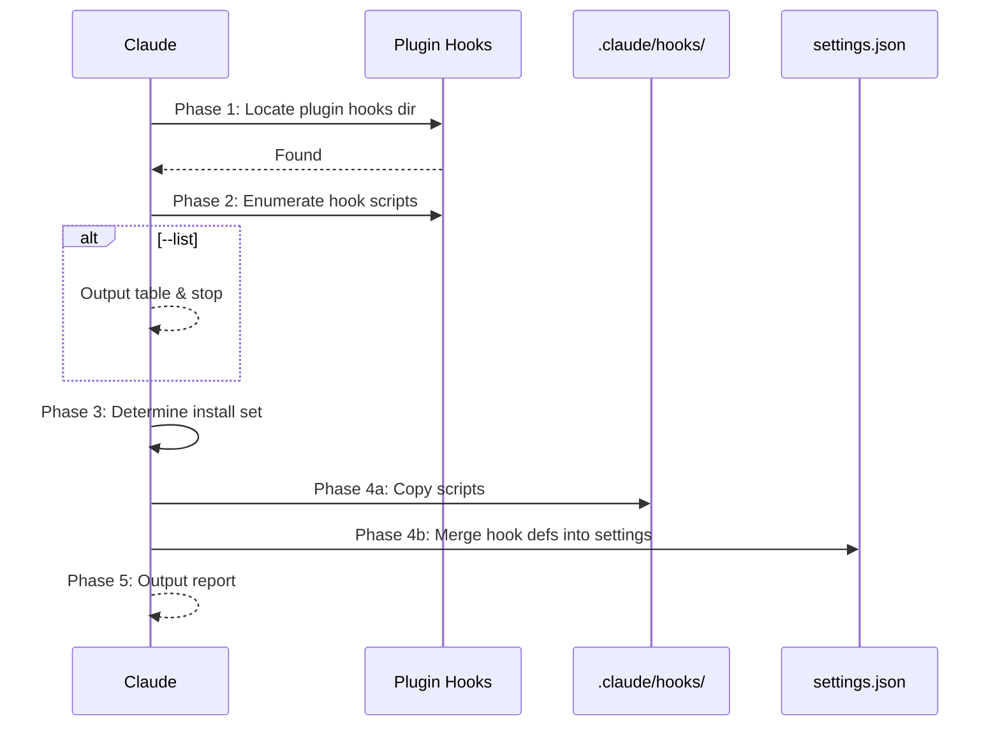

## Context

- Repo root: !`git rev-parse --show-toplevel`
- Existing local hooks: !`ls .claude/hooks/ 2>/dev/null || echo "(none)"`
- Settings file: !`ls .claude/settings.json 2>/dev/null || echo "(none)"`
- Local settings file: !`ls .claude/settings.local.json 2>/dev/null || echo "(none)"`

## Task

Install sd0x-dev-flow plugin hooks into the current project's `.claude/` directory so they persist even without the plugin loaded. This involves two layers: copying hook scripts and merging hook definitions into settings.

### Workflow



### Arguments

```
$ARGUMENTS
```

| Argument | Description |
|----------|-------------|
| `--all` | Install all available hooks |
| `--list` | List available hooks without installing |
| `--dry-run` | Show what would be installed, no changes |
| `--force` | Overwrite existing hooks with different content |
| `--local` | Write to `settings.local.json` instead of `settings.json` |
| `hook-names...` | Space-separated hook names (without .sh extension) |

### Phase 1: Locate Plugin Hooks Directory

Find the plugin's `hooks/` directory using this priority (short-circuit on first match):

1. **Glob search** — search known Claude plugin locations:

   ```
   Glob: ~/.claude/plugins/**/sd0x-dev-flow/hooks/pre-edit-guard.sh
   Glob: ${REPO_ROOT}/node_modules/sd0x-dev-flow/hooks/pre-edit-guard.sh
   ```

2. **Plugin-relative fallback** — since this command is loaded from the plugin, try reading `@hooks/pre-edit-guard.sh` to confirm accessibility. If readable, derive the hooks directory by resolving the path returned (parent of `pre-edit-guard.sh`).
3. **Error** — if no hooks directory found, report error and stop.

### Phase 2: Enumerate Available Hooks

Read all `.sh` files from the discovered hooks directory. The available hooks are:

| Hook | Event | Matcher | Purpose |
|------|-------|---------|---------|
| `pre-edit-guard.sh` | PreToolUse | Edit, Write | Block editing sensitive files (.env, .git/) |
| `post-edit-format.sh` | PostToolUse | Edit, Write | Auto-format + track code/doc changes |
| `post-tool-review-state.sh` | PostToolUse | Bash, mcp__codex__codex, mcp__codex__codex-reply | Parse review results, update state file |
| `stop-guard.sh` | Stop | — | Check review + precommit completed before stop |

> **Note**: The plugin's `SessionStart` hook (`namespace-hint.sh`) is intentionally excluded — it emits plugin-namespaced command guidance (`/sd0x-dev-flow:...`) which is incorrect for local installations where commands are accessed without namespace prefix.

If `--list` is specified, output this table and **stop**.

### Phase 3: Determine Installation Set

- `--all`: install all hooks found in Phase 2
- Specific `hook-names`: install only those (validate they exist)
- Neither: present the list and use AskUserQuestion to let the user select

### Phase 4: Check Conflicts and Install

Use `REPO_ROOT` from `git rev-parse --show-toplevel` for all absolute paths.

If `--dry-run`, compute the install plan (conflict detection, merge preview) without writing any files, output the plan table, and **stop**.

#### Phase 4a: Copy Scripts

1. Ensure target directory exists:

   ```bash
   mkdir -p ${REPO_ROOT}/.claude/hooks
   ```

2. For each hook script to install:

   | Scenario | Default | `--force` |
   |----------|---------|-----------|
   | `${REPO_ROOT}/.claude/hooks/<name>.sh` does not exist | **Copy** | **Copy** |
   | File exists, content identical | **Skip** (already installed) | **Skip** |
   | File exists, content differs | **Skip** + warn as conflict | **Overwrite** |

3. After copying: `chmod +x ${REPO_ROOT}/.claude/hooks/<name>.sh`

#### Phase 4b: Merge Hook Definitions into Settings

Target file: `${REPO_ROOT}/.claude/settings.json` (or `settings.local.json` with `--local`).

Hook definition mapping (use `$CLAUDE_PROJECT_DIR` for CWD-independent paths — [official pattern](https://code.claude.com/docs/en/hooks)):

```json
{
  "hooks": {
    "PreToolUse": [
      {"matcher": "Edit|Write", "hooks": [{"type": "command", "command": "\"$CLAUDE_PROJECT_DIR\"/.claude/hooks/pre-edit-guard.sh"}]}
    ],
    "PostToolUse": [
      {"matcher": "Edit|Write", "hooks": [{"type": "command", "command": "\"$CLAUDE_PROJECT_DIR\"/.claude/hooks/post-edit-format.sh"}]},
      {"matcher": "Bash|mcp__codex__codex|mcp__codex__codex-reply", "hooks": [{"type": "command", "command": "\"$CLAUDE_PROJECT_DIR\"/.claude/hooks/post-tool-review-state.sh"}]}
    ],
    "Stop": [
      {"matcher": "", "hooks": [{"type": "command", "command": "\"$CLAUDE_PROJECT_DIR\"/.claude/hooks/stop-guard.sh"}]}
    ]
  }
}
```

Merge strategy:
- Read existing settings file (create `{}` if not exists)
- **Legacy migration** (always, before merge): scan the target settings file for bare relative paths `.claude/hooks/<name>.sh` in hook commands and upgrade to `"$CLAUDE_PROJECT_DIR"/.claude/hooks/<name>.sh`. Also scan the **other** settings file (e.g., if writing to `settings.json`, also check `settings.local.json` and vice versa) — **warn** if legacy entries are found there, but do not auto-write the non-target file.
- For each event (PreToolUse/PostToolUse/Stop):
  - If no existing entries for this event → add all
  - If existing entries: check each hook's `command` path
    - Same command path exists → **Skip**
    - Different command at same matcher → **Skip** + warn (unless `--force`)
    - No matching entry → **Append**
- `--force` semantics: **Replace** the existing entry at the same matcher (not append a duplicate). Remove the old entry, then add the new one.
- Write updated settings back

### Phase 5: Output Report

## Output

```markdown
## Install Hooks Report

**Source**: <plugin-hooks-path>
**Scripts**: <repo-root>/.claude/hooks/
**Settings**: <actual-target-settings-path>

| Hook | Script | Settings | Status |
|------|--------|----------|--------|
| pre-edit-guard.sh | ✅ Copied | ✅ Added (PreToolUse) | Installed |
| post-edit-format.sh | ✅ Copied | ✅ Added (PostToolUse) | Installed |
| post-tool-review-state.sh | ✅ Copied | ✅ Added (PostToolUse) | Installed |
| stop-guard.sh | ⚠️ Exists (conflict) | — Skipped | Conflict |

**Installed**: N / **Skipped**: M / **Conflicts**: K

### Next Steps

- Review any skipped conflicts manually
- Hooks in the target settings file are auto-loaded by Claude Code for this project
- Use `HOOK_BYPASS=1` as emergency escape hatch
- Set `STOP_GUARD_MODE=strict` to enable blocking mode (default: warn)
```

## Examples

```bash
# List available hooks
/install-hooks --list

# Install all hooks
/install-hooks --all

# Install specific hooks only
/install-hooks pre-edit-guard stop-guard

# Preview what would happen
/install-hooks --all --dry-run

# Force overwrite existing hooks
/install-hooks --all --force

# Install to local settings (not committed)
/install-hooks --all --local
```
