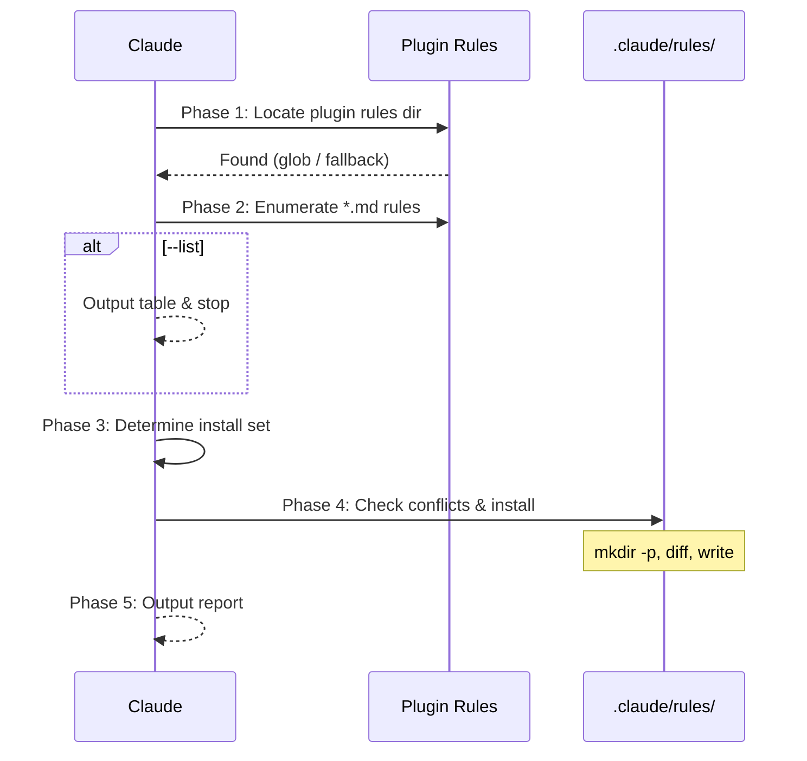

## Context

- Repo root: !`git rev-parse --show-toplevel`
- Existing local rules: !`ls .claude/rules/ 2>/dev/null || echo "(none)"`

## Task

Install jupiter-dev-flow plugin rules into the current project's `.claude/rules/` directory so they persist even without the plugin loaded.

> **Note**: Installed rules are behavioral guidance for Claude. They reference commands in short form (`/codex-review-fast`). When the jupiter-dev-flow plugin is loaded, commands are auto-namespaced as `/jupiter-dev-flow:codex-review-fast`. For full command execution support without the plugin, also run `/install-hooks` to set up the hook scripts locally.

### Workflow



### Arguments

```
$ARGUMENTS
```

| Argument | Description |
|----------|-------------|
| `--all` | Install all available rules |
| `--list` | List available rules without installing |
| `--dry-run` | Show what would be installed, no changes |
| `--force` | Overwrite existing rules with different content |
| `rule-names...` | Space-separated rule names (without .md extension) |

### Phase 1: Locate Plugin Rules Directory

Find the plugin's `rules/` directory using this priority:

1. **Glob search** — search known Claude plugin locations in order, short-circuit on first match:

   ```
   Glob: ~/.claude/plugins/**/jupiter-dev-flow/rules/auto-loop.md
   Glob: ${REPO_ROOT}/node_modules/jupiter-dev-flow/rules/auto-loop.md
   ```

2. **Plugin-relative fallback** — since this command is loaded from the plugin, try reading `@rules/auto-loop.md` to confirm the plugin's rules are accessible. If readable, derive the rules directory by resolving the path returned (parent of `auto-loop.md`).
3. **Error** — if no rules directory found, report error and stop.

The `rules/` directory is the parent of whichever `auto-loop.md` is found first.

### Phase 2: Enumerate Available Rules

Read all `.md` files from the discovered rules directory. The expected rules are:

| Rule | Purpose |
|------|---------|
| `auto-loop.md` | Auto review loop enforcement |
| `codex-invocation.md` | Codex independent research requirement |
| `fix-all-issues.md` | Zero tolerance for unfixed issues |
| `framework.md` | Framework conventions |
| `testing.md` | Test structure and requirements |
| `security.md` | OWASP security checklist |
| `git-workflow.md` | Git branch and commit conventions |
| `logging.md` | Structured logging standards |
| `docs-writing.md` | Documentation writing conventions |
| `docs-numbering.md` | Document numbering scheme |

If `--list` is specified, output this table and **stop**.

### Phase 3: Determine Installation Set

- `--all`: install all rules found in Phase 2
- Specific `rule-names`: install only those (validate they exist in the enumerated list)
- Neither: present the list and use AskUserQuestion to let the user select

### Phase 4: Check Conflicts and Install

Use the repo root from Context (Phase 0) to build absolute paths. All paths below use `REPO_ROOT` from `git rev-parse --show-toplevel`.

1. Ensure target directory exists:

   ```bash
   mkdir -p ${REPO_ROOT}/.claude/rules
   ```

2. For each rule to install:

   | Scenario | Default | `--force` |
   |----------|---------|-----------|
   | `${REPO_ROOT}/.claude/rules/<name>.md` does not exist | **Install** | **Install** |
   | File exists, content identical | **Skip** (already installed) | **Skip** |
   | File exists, content differs | **Skip** + warn as conflict | **Overwrite** |

3. If `--dry-run`, output the plan table and **stop** (do not write any files).

4. For each file to install: Read the source rule content, then Write to `${REPO_ROOT}/.claude/rules/<name>.md`.

### Phase 5: Output Report

## Output

```markdown
## Install Rules Report

**Source**: <plugin-rules-path>
**Target**: <repo-root>/.claude/rules/

| Rule | Status |
|------|--------|
| auto-loop.md | ✅ Installed |
| codex-invocation.md | ✅ Installed |
| docs-writing.md | ⚠️ Skipped (conflict — local override exists) |
| ... | ... |

**Installed**: N / **Skipped**: M / **Conflicts**: K

### Next Steps

- Review any skipped conflicts manually
- Rules in `.claude/rules/` are auto-loaded by Claude Code for this project
```

## Examples

```bash
# List available rules
/install-rules --list

# Install all rules
/install-rules --all

# Install specific rules only
/install-rules auto-loop fix-all-issues security

# Preview what would happen
/install-rules --all --dry-run

# Force overwrite existing rules
/install-rules --all --force
```
