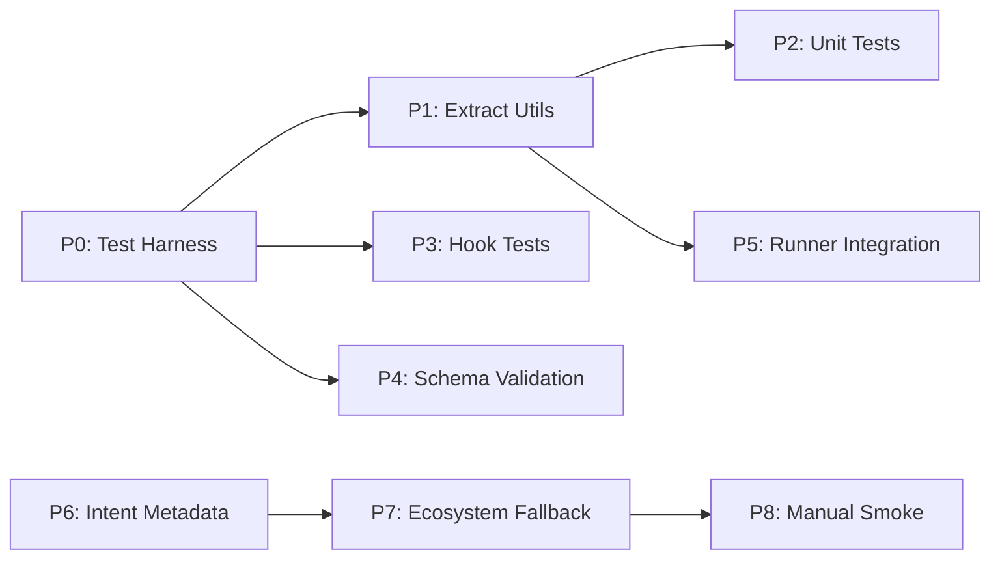

# Plugin Testing & Generalization — Feasibility Study Report

| Item | Decision |
|------|----------|
| Recommended option | **Option A**: Minimal Testing + Intent-First Generalization |
| Test runner | `node --test` (zero-dep, Node 18+) |
| Hook testing | `node --test` + `child_process.execFile` for bash hooks |
| Generalization | Intent metadata in frontmatter; Claude = universal runtime |
| Effort | 5-7 person-days |
| Total test scenarios | ~39 automated (7 unit + 14 hook + 4 schema + 7 JS runner + 7 dep-audit) + manual smoke |

## 1. Problem Essence

### 1.1 Surface Requirement

> Add tests to skills/scripts for stability, and make the plugin work universally across all project types, not just JS/TS.

### 1.2 Underlying Problem

The plugin's execution layer conflates **"what to do"** (intent: lint, test, build) with **"how to do it"** (ecosystem-specific: `npm run lint:fix`, `cargo clippy --fix`). This causes:

1. **Fragility** — Scripts have zero test coverage. Path resolution bugs (MODULE_NOT_FOUND) go undetected until users hit them.
2. **JS lock-in** — 3 scripts + 4 commands hardcode Node.js ecosystem assumptions. Non-JS projects get crude "skip" behavior.
3. **Hook gate risk** — Stop-guard and review-state hooks have complex regex/JSON logic that gates workflow correctness. A single regex error can brick all reviews or silently allow bad stops.

### 1.3 Success Criteria

| Criterion | Measurement |
|-----------|-------------|
| Script stability | All shared utility functions have tests covering success + failure paths |
| Hook reliability | 14+ test scenarios across stop-guard (8) + post-tool-review-state (6), covering strict + warn modes |
| Command integrity | All 36 commands pass frontmatter schema validation |
| Runner correctness | 7+ integration test scenarios for JS runners (shared matrix) + 7 for dep-audit, all pass |
| Non-JS support | `/precommit` on Python + Rust projects doesn't crash and produces sensible output |
| Zero regressions | Existing Node.js command behavior unchanged |

## 2. Constraints

| Type | Constraint | Source | Flexibility |
|------|-----------|--------|-------------|
| Technical | Zero external test dependencies (no Jest, no bats-core) | Plugin simplicity | Low |
| Technical | Node 18+ available (Claude Code dependency) | Runtime | None |
| Technical | No build step — plugin must remain "drop files and run" | Architecture | Low |
| Compat | Existing commands must not break | Stability | None |
| Compat | `allowed-tools` frontmatter must be respected | Security sandbox | None |
| Resource | Plugin is maintained by small team | Capacity | Medium |

## 3. Existing Capability Inventory

### 3.1 Related Modules

| Module | Purpose | Reusable? |
|--------|---------|-----------|
| `scripts/precommit-runner.js` (~530 lines) | Lint:fix → build → test:unit pipeline | Yes — shared utils extractable |
| `scripts/verify-runner.js` (~560 lines) | Lint → typecheck → unit → integration → e2e | Yes — ~100 lines duplicated with precommit |
| `scripts/dep-audit.sh` (~200 lines) | npm/yarn/pnpm vulnerability audit | Standalone, testable with stub binaries |
| `commands/precommit.md` | Try runner → fallback pattern | Pattern reusable for generalization |
| `hooks/stop-check.md` + bash hooks | Review gate enforcement | High-leverage test target |

### 3.2 Design Patterns

- **Try → Fallback**: Commands try script first, fallback to manual steps if script missing
- **Graceful Skip**: Missing scripts are skipped with log notes, not errors
- **AI-first resolution**: Claude reads intent + project context to choose commands
- **Frontmatter YAML**: Commands declare `description`, `allowed-tools`, optionally `intent`

### 3.3 Prior Work

Strategy brainstorm output (now consolidated into [tech spec](./2-tech-spec.md)) covered script testing strategy and ecosystem generalization at a strategic level. This feasibility study builds on that foundation with concrete implementation assessment.

### 3.4 Tech Debt

- ~100 lines duplicated between precommit-runner.js and verify-runner.js
- Hook scripts have no tests despite gating workflow correctness
- No schema validation for 36 command frontmatter files

## 4. Possible Solutions

### Option A: Minimal Testing + Intent-First Generalization (Recommended)

**Core idea**: Test what exists (scripts + hooks), validate command integrity, and let Claude's reasoning handle non-JS ecosystems via intent metadata — no new runtime code.

**Implementation path**:

| Phase | Deliverable | Dependency | Status |
|-------|-------------|------------|--------|
| P0 | Test harness skeleton (`node --test`, helpers for temp dirs + hook execution) | None | ✅ Done |
| P1 | Shared utility extraction ([`scripts/lib/utils.js`](../../../scripts/lib/utils.js)) | None | ✅ Done |
| P2 | Unit tests for shared utilities ([`test/scripts/lib/utils.test.js`](../../../test/scripts/lib/utils.test.js)) | P0, P1 | ✅ Done |
| P3 | Hook behavioral tests ([`test/hooks/`](../../../test/hooks/)) — stop-guard: 8, review-state: 6 | P0 | ✅ Done |
| P4 | Command frontmatter schema + intent validation ([`test/commands/schema.test.js`](../../../test/commands/schema.test.js)) | P0 | ✅ Done |
| P5 | Runner integration tests ([`test/scripts/`](../../../test/scripts/)) — 13 scenarios | P1 | ✅ Done |
| P6 | Intent YAML frontmatter on 4 commands + ecosystem detection in fallback | None | ✅ Done |
| P7 | Ecosystem detection in fallback instructions (5 ecosystems) | P6 | ✅ Done |
| P8 | Manual smoke test checklist for Python/Rust/Go | P7 | Pending |

**Feasibility assessment**:

| Dimension | Rating | Notes |
|-----------|:------:|-------|
| Technical Feasibility | 🟢 | Uses existing patterns; `node --test` zero-dep; hooks testable via `execFile` |
| Effort | 🟢 | 5-7 person-days |
| Risk | 🟢 | Small change scope; shared util extraction is the riskiest part |
| Extensibility | 🟢 | Intent metadata scales to new ecosystems with zero code changes |
| Maintenance Cost | 🟢 | Tests are behavior-based, not implementation-coupled |

**Cost**:
- Shared utility extraction requires careful refactoring of 2 files
- Intent metadata requires updating 4 command markdown files
- Manual smoke tests require maintaining a checklist document

---

### Option B: Universal Bash Runner + Full Testing

**Core idea**: Build one cross-ecosystem runner in bash that detects ecosystem and executes canonical steps; `precommit`/`verify` become thin wrappers.

**Implementation path**:

1. Create `scripts/universal-runner.sh` (~300 lines) with ecosystem detection + step execution
2. Port canonical step mapping from docs to executable logic
3. Add `scripts/detect-ecosystem.sh` helper
4. Unit tests for ecosystem detection
5. Integration tests across Node/Python/Rust/Go/Java fixture repos with stubbed CLIs
6. Migrate 4 commands to use universal runner
7. Keep existing JS runners as fallback for Node.js projects

**Feasibility assessment**:

| Dimension | Rating | Notes |
|-----------|:------:|-------|
| Technical Feasibility | 🟡 | Bash JSON parsing is painful; cross-platform nuances (macOS vs Linux) |
| Effort | 🟡 | 8-12 person-days |
| Risk | 🟡 | Higher surface area; each ecosystem needs maintenance |
| Extensibility | 🟡 | New ecosystems require code changes to runner |
| Maintenance Cost | 🔴 | Bash is hard to maintain; every ecosystem is a new code path |

**Cost**:
- New ~300-line bash script to maintain
- Stubbed CLIs for 5+ ecosystems in test fixtures
- Cross-platform testing burden (bash differences between macOS/Linux)

---

### Option C: Codegen from Declarative Spec

**Core idea**: Introduce a YAML/JSON workflow spec as single source of truth; generate runner logic + command frontmatter from it.

**Implementation path**:

1. Design workflow spec schema (YAML)
2. Build codegen tool (Node.js script) to produce command.md files + runner logic
3. Add schema validation tests
4. Add snapshot tests for generated output
5. Integration tests for generated runner against fixture repos

**Feasibility assessment**:

| Dimension | Rating | Notes |
|-----------|:------:|-------|
| Technical Feasibility | 🟡 | Technically possible but adds build step |
| Effort | 🔴 | 10-15 person-days |
| Risk | 🟡 | Codegen adds complexity; contributors must learn spec |
| Extensibility | 🟢 | New ecosystems = new spec entry, auto-generates everything |
| Maintenance Cost | 🟡 | Spec is clean but codegen logic needs maintenance |

**Cost**:
- Breaks "drop files and run" — introduces build dependency
- Contributors must learn spec format
- Codegen tool itself needs tests

## 5. Codex In-Depth Discussion Record

### 5.1 Discussion Process Summary

| Round | Discussion Topic | Codex Key Viewpoint |
|-------|-----------------|---------------------|
| 1 | Initial solution enumeration | Proposed 3 approaches: incremental testing, universal runner, codegen from spec |
| 2 | Challenge: universal runner is paradoxical for non-JS | Agreed; conceded universal runner is only justified for compliance-grade reproducibility |
| 3 | Challenge: mapping table in docs = feature not bug | Partially agreed; proposed doc-lint test as guardrail |
| 4 | Counter-proposal: frontmatter schema test vs doc-lint | Agreed to skip doc-lint, adopt frontmatter schema validation |
| 5 | Final consolidation + gap check | Added coverage nuance, hook mode testing, frontmatter exemptions, cache isolation, manual smoke checklist |

### 5.2 Solution Directions Suggested by Codex

- Hook behavioral tests (concrete 14 test cases) — adopted
- Doc-lint test for mapping table — rejected in favor of frontmatter schema validation
- `detect-ecosystem.sh` as lightweight deterministic helper — deferred (add only if manual smoke tests show Claude struggles)
- Runner integration tests should isolate cache dir via env var — adopted

### 5.3 Risks/Issues Identified by Codex

- Intent metadata may not be consumed in all Claude runs (context limits, different agent) — mitigated via dual encoding in markdown body
- Commands without Bash blocks (e.g., `zh-tw.md`) shouldn't require `allowed-tools` — add exemption rule to schema test
- `dep-audit.sh` without `jq` is a realistic edge case worth testing — adopted
- Runner integration tests write to `.claude/cache` and need isolation — adopted

### 5.4 Differences from Claude's Analysis

| Viewpoint | Claude | Codex | Adopted |
|-----------|--------|-------|---------|
| Mapping table durability | Docs-as-config is fine | Needs guardrails (doc-lint) | Claude (frontmatter schema instead) |
| Universal runner value | Not worth it | Useful for compliance | Claude (defer unless needed) |
| Hook test priority | P2 (after utils) | P1 (highest leverage) | Codex's argument is valid; flexible ordering |
| Generalization testability | Manual smoke checks | Semi-automated proxies | Hybrid: schema tests + manual smoke |
| Test runner for hooks | Node `execFile` | Node `execFile` | Agreed |

### 5.5 Integrated Conclusion

Both perspectives converge on **Option A** as the recommended path. The key insight is that Claude Code itself IS the universal runtime — building another runner is redundant. Testing effort should focus on the **high-leverage fragile points** (hooks, shared utils, command schema) rather than trying to test AI reasoning behavior.

## 6. Solution Comparison

| Dimension | Option A (Minimal) | Option B (Universal Runner) | Option C (Codegen) |
|-----------|:------------------:|:---------------------------:|:------------------:|
| Technical Feasibility | 🟢 | 🟡 | 🟡 |
| Effort | 🟢 5-7d | 🟡 8-12d | 🔴 10-15d |
| Risk | 🟢 | 🟡 | 🟡 |
| Extensibility | 🟢 | 🟡 | 🟢 |
| Maintenance Cost | 🟢 | 🔴 | 🟡 |
| Zero-dep philosophy | 🟢 Preserved | 🟡 Adds bash complexity | 🔴 Adds build step |

## 7. Recommendation

**Recommended**: Option A — Minimal Testing + Intent-First Generalization

**Rationale**:

- Meets all constraints: zero external deps, no build step, backwards compatible
- Highest ROI: targets the fragile points (hooks, shared utils, schema) that cause real user pain
- Leverages Claude's reasoning for generalization instead of building redundant tooling
- Codex agreed this is the strongest approach for the current scale

**Backup**: Option C (Codegen from spec)

**Applicable scenario**: If the plugin grows to 100+ commands with complex ecosystems-specific logic, and maintainability of individual markdown files becomes unmanageable, codegen from a spec would reduce drift. Not justified at current scale (36 commands).

## 8. Open Questions

- [ ] Should hook tests cover `post-edit-format.sh` (prettier auto-format) or only the gate hooks?
- [ ] What is the minimum set of ecosystems for the manual smoke test? (Proposed: Python + one compiled language)
- [x] ~~Should we add a `test` script to `package.json`?~~ — Resolved: [`package.json`](../../../package.json) defines `test`, `test:unit`, `test:integration`, `test:schema`
- [ ] For frontmatter schema validation, should we enforce `intent:` on all commands or only the 4 runner-backed ones?

## 9. Test Matrix Summary

> **Note**: This matrix shows the full *planned* test coverage. For currently implemented tests, see [tech spec Section 2](./2-tech-spec.md#2-test-suite). Scenarios not yet implemented are marked in the Phase table above (P3 pending).

### Unit Tests (shared utilities)

| Function | Success Path | Failure Path | Edge Cases |
|----------|:---:|:---:|:---:|
| `safeSlug` | normal string | — | empty, special chars, >80 chars |
| `sha1` | known hash | — | empty string, unicode |
| `hasScript` | script exists | null pkg, no scripts key | — |
| `pmCommand` | npm/yarn/pnpm | — | extra args |
| `detectPackageManager` | lockfile present | no lockfile (defaults npm) | both lockfiles |
| `parseArgs` | valid flags | — | unknown args, defaults |
| `tailLinesFromFile` | small file | missing file | empty file, large file |

### Hook Tests

| Hook | Scenario | Expected |
|------|----------|----------|
| stop-guard | code change, review not passed (strict) | exit 2, blocked |
| stop-guard | doc change, doc review not passed (strict) | exit 2, blocked |
| stop-guard | all passed | exit 0, ok |
| stop-guard | transcript has edit but no review (strict) | exit 2 |
| stop-guard | transcript has blocked then pass | exit 0 |
| stop-guard | HOOK_BYPASS=1 | exit 0 always |
| stop-guard | no transcript / missing file | exit 0 |
| stop-guard | code change, review not passed (warn) | exit 0, warning |
| post-tool-review-state | `/codex-review-fast` with ✅ | code_review.passed = true |
| post-tool-review-state | `/codex-review-fast` with ⛔ | code_review.passed = false |
| post-tool-review-state | `/codex-review-doc` with ✅ | doc_review.passed = true |
| post-tool-review-state | `/precommit` with ✅ | precommit.passed = true |
| post-tool-review-state | Non-review tool | no state file written |
| post-tool-review-state | Re-run: false → true | flips correctly |

### Command Schema Validation

| Rule | Applies To | Check |
|------|-----------|-------|
| `description` required | All 36 commands | Non-empty string |
| `allowed-tools` required | Commands containing Bash blocks | Non-empty string |
| `allowed-tools` exempt | Meta commands without Bash blocks (e.g., `zh-tw`) | Skip check |
| `intent.steps[].name` valid | Commands with `intent:` block | Must be canonical step name |

### Runner Integration Tests

| Test Case | Runner | Assert |
|-----------|--------|--------|
| **JS Runner Tests** (temp git repo + dummy scripts that exit 0/1, cache isolated via env var) | | |
| Full precommit (all scripts) | precommit | 3 steps pass, summary.json valid |
| Missing lint:fix | precommit | 2 steps, lint skipped |
| Build failure | precommit | overallPass: false |
| Fast mode | verify | only lint + unit |
| Full with typecheck | verify | typecheck runs |
| Test fallback (test → test:unit) | both | uses fallback script |
| Log/summary output | both | all files exist and valid |
| **dep-audit Tests** (stub binaries in PATH, no real package managers invoked) | | |
| dep-audit: moderate+ found (default level) | dep-audit | exit 1 |
| dep-audit: level=high, only moderate | dep-audit | exit 0 (below threshold) |
| dep-audit: clean | dep-audit | exit 0 |
| dep-audit: --fix | dep-audit | fix command executed |
| dep-audit: --help | dep-audit | usage text, exit 0 |
| dep-audit: no jq installed | dep-audit | defaults to 0, no crash |
| dep-audit: unknown arg | dep-audit | exit 2 |

## 10. Next Steps

- ✅ [Tech Spec](./2-tech-spec.md) — Detailed design with implementation links
- ✅ P0-P7 all completed — 34 automated tests passing
- Pending: P8 — Manual smoke test for Python/Rust/Go projects
