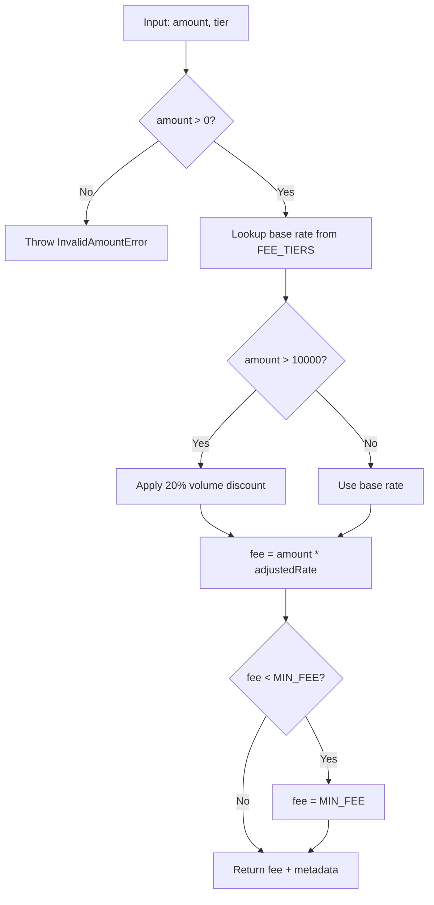

# Code Walkthrough Output Template

## Full Output Structure

```markdown
## Code Walkthrough: [scope description]

- **Scope**: [git diff range or file list]
- **Files changed**: [N]
- **Functions analyzed**: [M] (top [N] by complexity)

---

### 1. Change Inventory

| File | Type | Key Functions | Complexity | Summary |
|------|------|---------------|:----------:|---------|
| `src/service/order.service.ts` | Modified | `calculateFee()`, `validateOrder()` | High | Fee calculation with tiered pricing |
| `src/provider/cache.ts` | New | `invalidate()`, `warmUp()` | Medium | Cache invalidation strategy |
| `test/unit/order.test.ts` | New | - | - | Unit tests for order service |

**Legend**: Complexity = High (algorithm/state machine/recursion) | Medium (branching logic) | Low (CRUD/config)

---

### 2. Core Logic Walkthrough

#### `calculateFee(amount, tier)` — src/service/order.service.ts:42

**Purpose**: Calculate transaction fee based on amount and user tier, with volume discount.

**Step-by-step**:
1. Validate `amount > 0`, throw `InvalidAmountError` if not
2. Look up base rate from `FEE_TIERS[tier]` (0.1% ~ 0.5%)
3. Apply volume discount: if `amount > 10000`, reduce rate by 20%
4. Calculate `fee = amount * adjustedRate`
5. Apply minimum fee floor (`MIN_FEE = 0.01`)
6. Return `{ fee, rate: adjustedRate, discount: appliedDiscount }`

**Key decisions**:
- Minimum fee floor prevents zero-fee transactions on small amounts
- Volume discount is percentage-based (not fixed) to scale with amount



---

#### `invalidate(keys, strategy)` — src/provider/cache.ts:15

**Purpose**: Invalidate cache entries with configurable strategy (exact vs pattern).

**Step-by-step**:
1. If `strategy === 'exact'`: delete each key directly
2. If `strategy === 'pattern'`: scan keys matching glob pattern, batch delete
3. Emit `cache:invalidated` event with affected key count
4. Return count of invalidated entries

---

### 3. Test Coverage Map

| Behavior | Test File:Case | Boundary Conditions |
|----------|---------------|---------------------|
| Normal fee calculation | `order.test.ts:calculateFee > returns correct fee for standard tier` | amount=100, tier=standard |
| Volume discount applied | `order.test.ts:calculateFee > applies discount above threshold` | amount=10001 (just above threshold) |
| Minimum fee floor | `order.test.ts:calculateFee > enforces minimum fee` | amount=0.001 (tiny amount) |
| Invalid amount | `order.test.ts:calculateFee > throws on negative amount` | amount=-1 |
| Cache exact invalidation | `cache.test.ts:invalidate > deletes exact keys` | keys=["a","b"] |
| Cache pattern invalidation | `cache.test.ts:invalidate > matches glob pattern` | pattern="user:*" |

---

### 4. Uncovered Risks

| Risk | Location | Severity | Suggestion |
|------|----------|:--------:|------------|
| No test for `amount = 0` (boundary) | `calculateFee()` | Medium | Add test: `amount=0` should throw or return MIN_FEE |
| No test for unknown tier value | `calculateFee()` | Medium | Add test: `tier="unknown"` behavior |
| Cache pattern scan on large keyspace | `invalidate()` | Low | Consider timeout/limit on pattern scan |
| Missing test for empty keys array | `invalidate()` | Low | Add test: `keys=[]` returns 0 |
```

## Complexity Classification Guide

| Complexity | Indicators | Walkthrough Depth |
|:----------:|------------|-------------------|
| **High** | Loops, recursion, state machines, 3+ conditional branches, algorithm logic, concurrent operations | Full step-by-step + Mermaid diagram |
| **Medium** | Business logic with branching, data transformation, validation chains | Step-by-step (no diagram unless requested) |
| **Low** | Simple CRUD, config changes, type definitions, import updates | One-sentence summary in inventory only |

## Mermaid Diagram Selection

| Logic Pattern | Diagram Type |
|---------------|-------------|
| Branching / decision tree | `flowchart TD` |
| Multi-module interaction | `sequenceDiagram` |
| State transitions | `stateDiagram-v2` |
| Data pipeline | `flowchart LR` |
